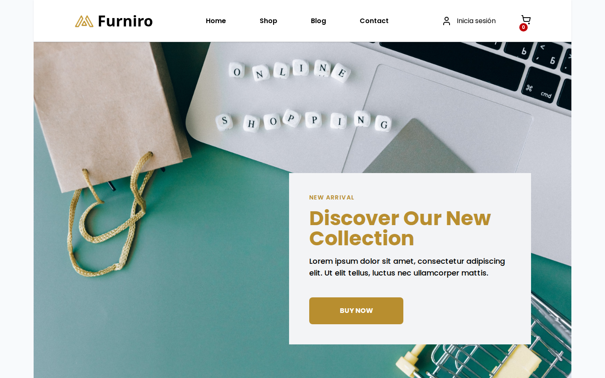
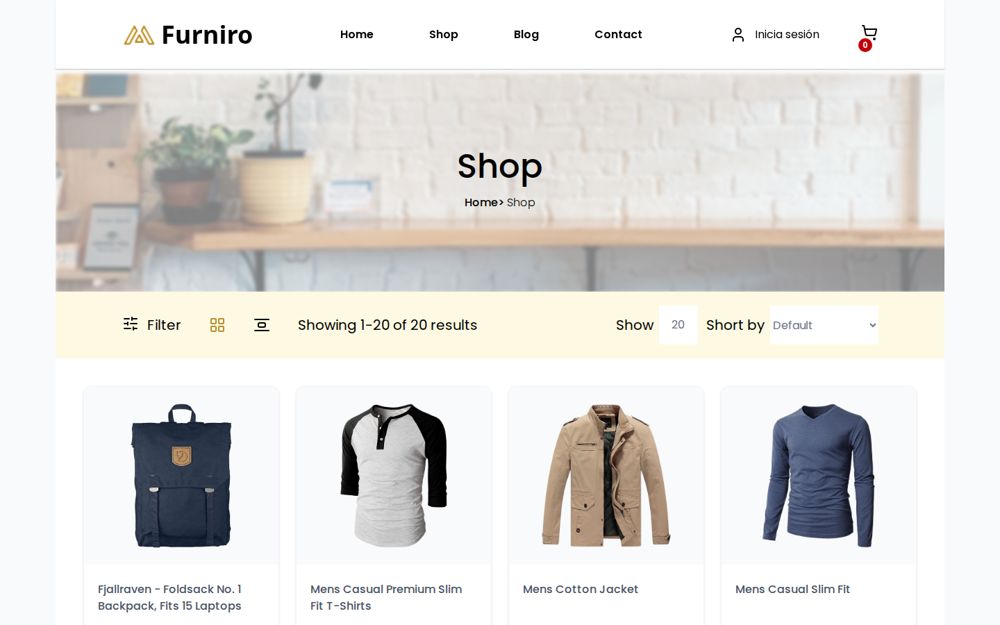

<h1 align="center">Furniro</h1>
<p align="center">E-commerce de muebles con catálogo dinámico, carrito persistente y checkout protegido.</p>

<p align="center">
  
  
  
  
  
</p>

<p align="center">
  <a href="https://furniro-react-ecommerce.vercel.app"></a>
  <a href="https://github.com/leandro291/furniro-ecommerce-backend"></a>
</p>


<p align="center">
  
</p>

<p align="center">
  
</p>

## Tech Stack
| Category           | Technology                   |
| ------------------ | ---------------------------- |
| **Library**        | React 19                     |
| **Build Tool**     | Vite                         |
| **Routing**               | React Router Dom 7                       |
| **State Management**      | Zustand                                  |
| **UI & Styling**          | Tailwind CSS 4 + Lucide React            |
| **UI Components**         | Swiper (Galleries & Carousels)           |
| **Data Fetching**         | Axios + @uidotdev/usehooks               |
| **Mock Backend & Auth**   | Fake Store API                           |
| **Form Handling**         | EmailJS                                  |

## Prerequisites

- **Node.js**: v18.0 or higher (v22+ recommended).
- **Package Manager**: npm, yarn (v1.22+), or pnpm.
- **Git**: For version control and cloning the repository.
- **EmailJS Account**: A Public Key is required to enable the Contact Form functionality.

## Getting Started

Follow these steps to run the project locally:

1. **Clone the repository:**
   ```bash
   git clone [https://github.com/your-username/your-repo-name.git](https://github.com/your-username/your-repo-name.git)
   cd your-repo-name

2. **Install dependencies**

```bash
npm install
```

3. **Configure Environment Variables**

Create a .env file in the root directory and add your EmailJS credentials:

```bash
   VITE_EMAILJS_SERVICE_ID=your_service_id
   VITE_EMAILJS_TEMPLATE_ID=your_template_id
   VITE_EMAILJS_PUBLIC_KEY=your_public_key
```

4. **Start the development server**

```bash
npm run dev
```

   Server runs at `http://localhost:5173`

## Test Credentials

To simulate a real-world experience, the platform includes a restricted checkout process. Users must be authenticated to finalize a purchase.

- **Username:** `kevinryan`
- **Password:** `kev02937@`

## Scripts

In the project directory, you can run the following commands:

| Command | Description |
| :--- | :--- |
| `npm run dev` | Starts the development server using **Vite**. Usually runs on `http://localhost:5173`. |
| `npm run build` | Compiles and optimizes the project for production. The output is generated in the `/dist` folder. |
| `npm run preview` | Locally previews the production build generated in the `/dist` folder. |
| `npm run lint` | Runs **ESLint** to analyze code quality and ensure Level 05 architectural standards. |

## Architecture

The application follows a **Feature-Based Architecture** with clear separation of concerns.

### Project Structure

```
src/
├── app/                  # Bridge layer for routing logic
├── assets/               # Static resources (images, fonts, etc.)
├── common/               # Global UI and Persistent Design
│   ├── components/       # Layout components (Navbar, Footer)
│   ├── layouts/          # MainLayout (Container with Outlet)
│   ├── shared/           # Global navigation constants
│   └── ui/               # Atomic components (Logo, base buttons)
├── features/             # Domain-driven business logic
│   └── pages/shop/       # Main domain: E-Commerce
│       ├── components/   # Internal feature components (Cart, Checkout, Blog...)
│       ├── constants/    # Static shop data (Benefits, Categories)
│       ├── hooks/        # Reactive logic (use-get-products, use-auth)
│       ├── pages/        # Page assemblers (Home.jsx, Shop.jsx)
│       ├── services/     # External API connections (Fake Store API)
│       ├── shared/       # Feature-specific reusable UI (Skeletons, ProductCards)
│       ├── store/        # Global State management with Zustand
│       └── utils/        # Pure logic (Rating display)
├── router/               # Central routing configuration (React Router)
├── App.jsx               # Main application entry point
└── main.jsx              # DOM mounting point
```

## Key Features

- **Robust Cart Management:** Full shopping experience with global state management using **Zustand**, allowing users to add, remove, and manage items seamlessly.
- **Simulated Authentication:** Integrated Login flow using **Fake Store API** endpoints to simulate real-world user session handling.
- **Advanced Analytics** with interactive charts
- **Dynamic Data Integration:** Real-time product and category fetching using **Axios** from a REST API, ensuring a data-driven UI.
- **Interactive Components:** Fluid product galleries and carousels implemented with **Swiper JS** for an engaging user experience.
- **Functional Contact Form:** Direct communication channel integrated with **EmailJS**, enabling real email delivery without a custom backend.
- **Smart Routing:** Client-side navigation powered by **React Router 7**, including dynamic product details and protected simulation flows.

## Development

### Creating a New Feature

1. **Create the Feature Domain:**
   Identify if it belongs to the existing `shop` domain or requires a new folder in `src/features/pages/`.
2. **Follow the Internal Structure:**
   Inside your feature folder, organize your code as follows:
   - `components/`: Pure UI components for the feature.
   - `hooks/`: Reactive logic and data fetching (using Axios).
   - `services/`: API calls to Fake Store API.
   - `store/`: Global state updates via Zustand.
3. **Register in the Bridge Layer:**
   Expose your main feature assembler through the `src/app/` folder. This acts as the connection between the router and the logic.

4. **Update Routing:**
   Add the new route in `src/router/index.jsx` using the `createBrowserRouter` configuration.

5. **Commit your changes:**
   Use conventional commits: `feat: add product comparison functionality`.

### Data Access Pattern

Use Repository pattern from `src/features/pages/shop/hooks/use-products.js`:

```
const { products, loading, error } = useGetProducts();
```

## Code Quality

- **Single Responsibility Principle (SRP):** Each layer is decoupled. **Services** handle API communication (Axios), **Hooks** manage reactive state, and **Components** focus exclusively on the UI.
- **Centralized State Management:** Optimized data flow using **Zustand**, ensuring persistent shopping cart state and consistent user sessions without prop-drilling.
- **Modern Styling Architecture:** Leveraging **Tailwind CSS 4** for high-performance utility-first styling and a fully responsive design.

Run code checks:

```bash
npm run lint
```

## Contributing

1. Create feature branch: `git checkout -b feature/name`
2. Make changes and commit: `git commit -m "feat: description"`
3. Verify code: `npm run lint`
4. Open Pull Request

### Commit Convention

```
feat: add feature
fix: fix bug
style: formatting
refactor: code refactoring
chore: dependencies
docs: for documents
```

## Resources

- [React Docs](https://react.dev)
- [Vite Guide](https://vitejs.dev)
- [React Router Dom v7](https://reactrouter.com/)
- [Zustand](https://zustand.docs.pmnd.rs/)
- [TailwindCSS](https://tailwindcss.com)
- [Axios](https://axios-http.com/)
- [Fake Store API](https://fakestoreapi.com/)
- [Lucide React](https://lucide.dev/)
- [Swiper JS](https://swiperjs.com/)
- [EmailJS](https://www.emailjs.com/)


## License

Proprietary - Leandro Rojas Ortega